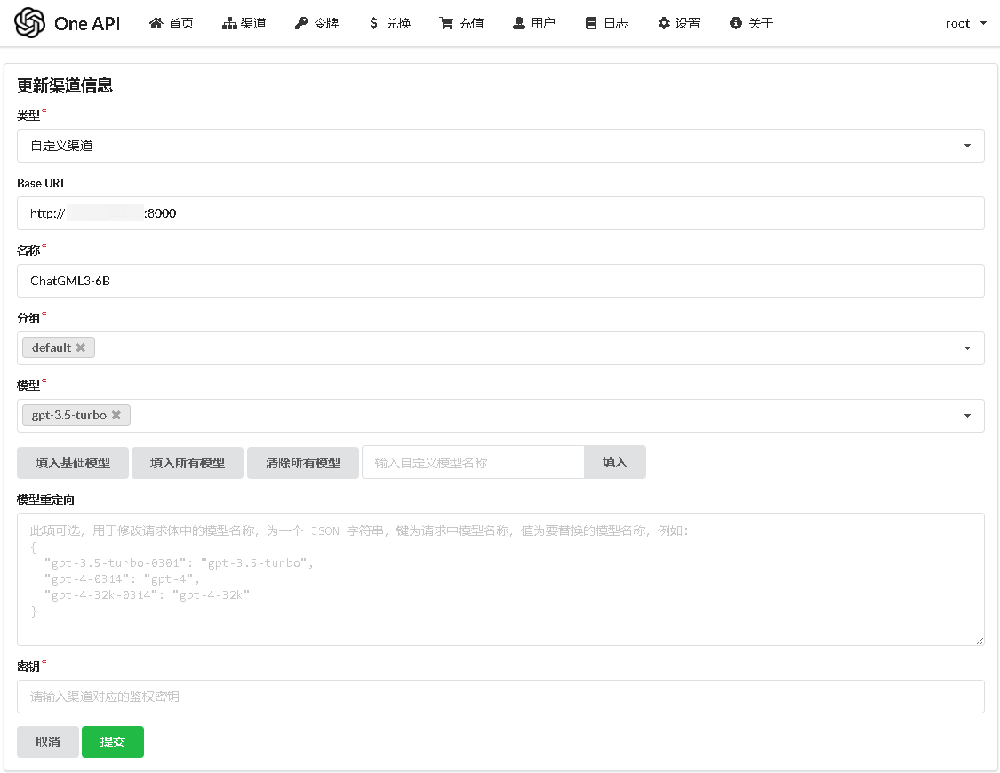
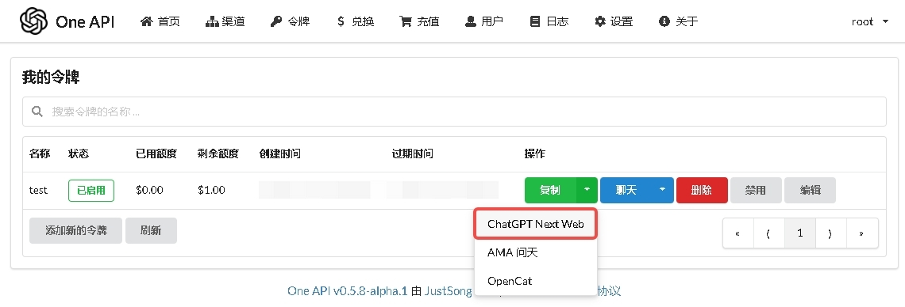
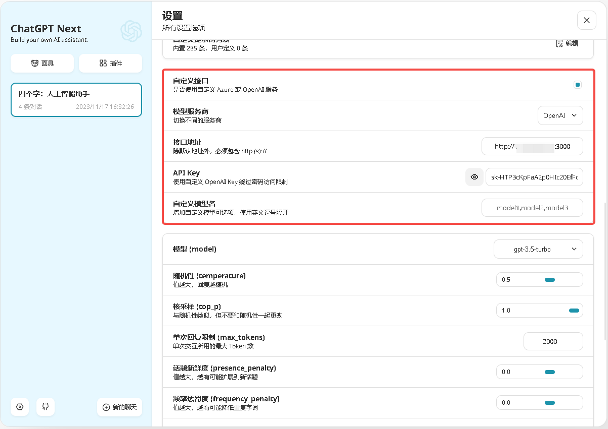
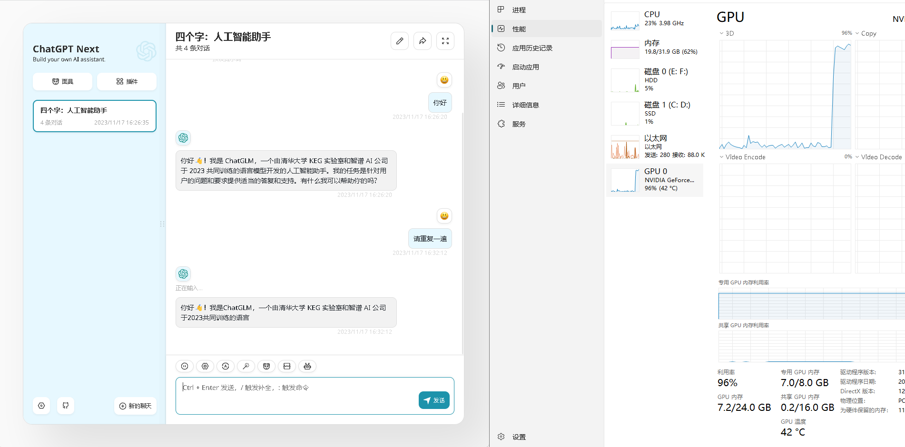

# Quick Start LLM

快速启动自托管、可扩展、管理友好的`LLM`环境，使用`One-Api`分发和管理`Key`。

## 目前支持的`LLM`

- [x] [ChatGLM3](https://github.com/THUDM/ChatGLM3)

- [ ] [LLaMA](https://github.com/facebookresearch/llama)

- [ ] [Chinese-LLaMA-Alpaca-2](https://github.com/ymcui/Chinese-LLaMA-Alpaca-2)

- [ ] [Baichuan2](https://github.com/baichuan-inc/Baichuan2)

## 目前支持的推理工具

- [ ] [llama.cpp](https://github.com/ggerganov/llama.cpp)

- [ ] [LocalAI](https://github.com/mudler/LocalAI)

## 快速启动

> 默认使用`ChatGLM3-6B`模型，`4bit`量化，`OpenAI`格式的`Api`启动，使用`GPU`推理。 

### 前提

> 暂不支持AMD显卡和苹果M系列GPU。

带有`Nvidai`显卡（显存>=8GB），并且已经正确安装驱动的`Windows`、`Linux`环境。

或者使用CPU推理的`Windows`、`Linux`、`MacOS`环境。

[Docker](https://docs.docker.com/desktop/)

[Docker-compsoe](https://docs.docker.com/compose/)

### 下载模型

进入模型目录
```
cd ./models/THUDM
```
下载模型
```
git lfs install
git clone https://www.modelscope.cn/ZhipuAI/chatglm3-6b.git
```
### 配置文件

复制`.env.template`到`.env`

```
cp .env.template .env
```

### 启动

```
docker-compose up -d
```

### 配置

打开`One-Api` `http://ServerIP:3000/login`

初始账号用户名为 `root`，密码为 `123456`，修改初始密码。

点击导航栏渠道，添加本地启动的ChatGML3到渠道。

可参考以下值填写：

```
类型：自定义渠道

Base URL：http://serverip:8000

名称：ChatGLM3-6B

分组：default

模型：gpt-3.5-turbo

模型重定向：-

密钥：none
```



填写完毕后点击提交

点击导航栏渠道按钮，点击新添加的渠道测试按钮，测试成功则代表本地ChatGLM3已启动成功。

至此，已经把本地`ChatGLM3`，添加到了`One-Api`。可以通过`One-Api`分发密钥，此密钥可直接用于兼容`OpenAI API`的`ChatGPT`程序。

### 分发密钥

完成以上部分之后，我们可以开始分发并使用密钥了。这里以`ChatGPT Next Web`为例。

点击创建新的令牌，选择参数，创建完毕后，复制令牌，选择 `ChatGPT Next Web`。



这里复制的格式如下，只需要`Key`部分`sk-HTP3cKpFaA2p0HIc20EfFc0a412c4fF1812a4a420f343a04`
```
https://chat.oneapi.pro/#/?settings={"key":"sk-HTP3cKpFaA2p0HIc20EfFc0a412c4fF1812a4a420f343a04","url":"http://localhost:3000"}
```

打开`http://ServerIP:3001/`，点击左下角设置，勾选自定义接口按钮，填写接口地址为`One-Api`地址`http://ServerIP:3000`，`API_KEY`一栏填写上一步拿到的`Key` `sk-HTP3cKpFaA2p0HIc20EfFc0a412c4fF1812a4a420f343a04`



演示


至此，整个环境搭建完成。

## 致谢

[One-Api](https://github.com/songquanpeng/one-api)：OpenAI 接口管理 & 分发系统；

[ChatGLM3](https://github.com/THUDM/ChatGLM3)：开源双语对话语言模型；

[ChatGPT-Next-Web](https://github.com/Yidadaa/ChatGPT-Next-Web)：跨平台 ChatGPT 应用；